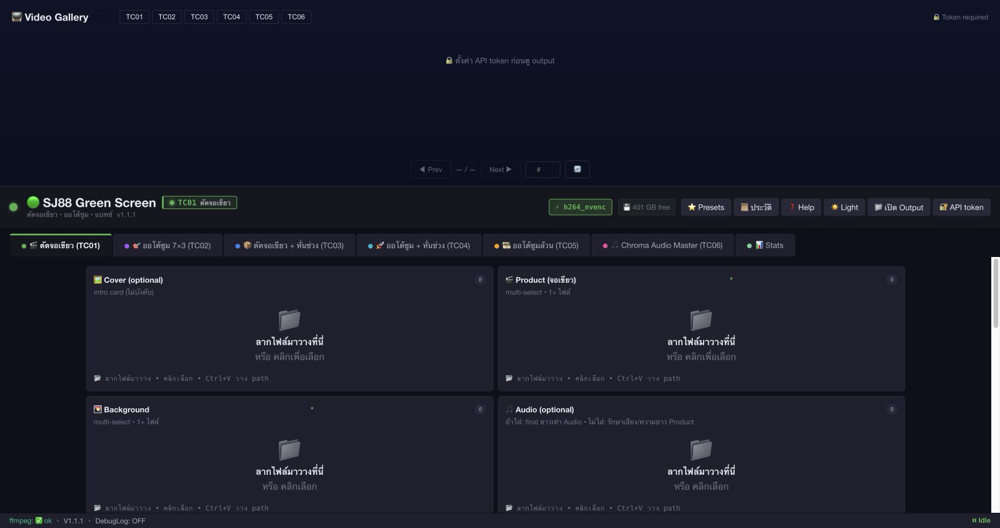
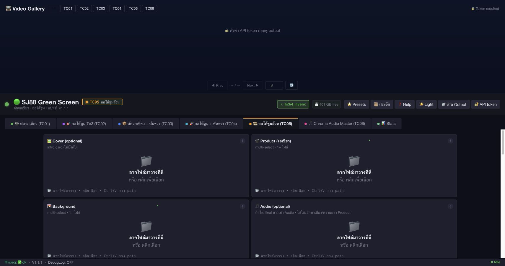
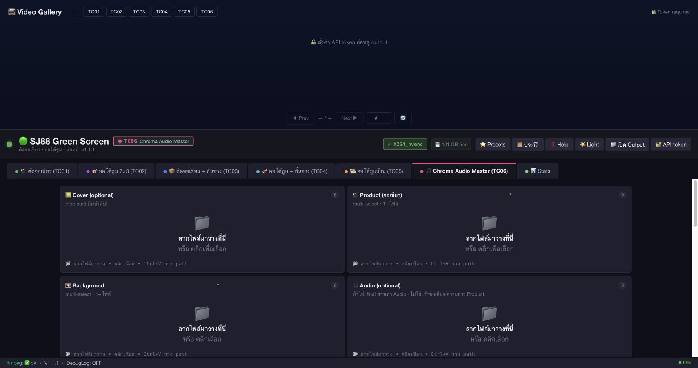
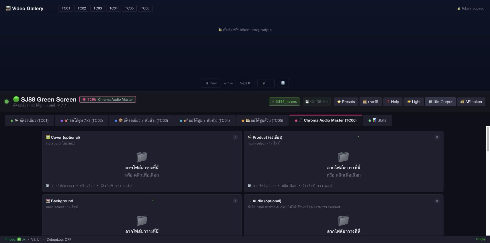
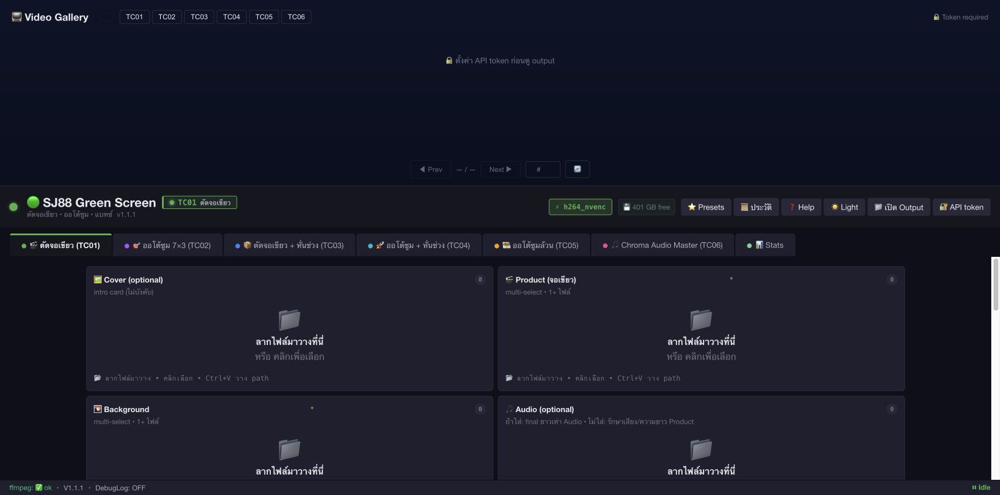

# Green Cutdee: ศึกษา Upload → Worker → Job → Download

## Project identity

- Project ID: green.cutdee.com
- Project Name: Green Cutdee V3 cursor API
- Repo Root: /Users/sj88/Documents/codex/V3_cursor_API
- Environment: production
- Source of Truth: hybrid — deployed SHA-256 + live API + browser UI + server runtime/worker registry
- Public UI: https://green.cutdee.com/
- Public API: https://green.cutdee.com/api/
- OpenAPI ที่ใช้งานได้: https://green.cutdee.com/v3api/openapi.json
- Gateway server: 103.253.75.161
- Current gateway version observed: 1.2.0, commit f6299fa
- Current UI version observed: V1.1.1
- Notion global rules: https://www.notion.so/3435a17a475f818bae05c4dca1bb6aba
- Study mode: read-only; ไม่อัปโหลดไฟล์จริง, ไม่ render, ไม่ดาวน์โหลด output จริง และไม่แก้ production
- AI Full Dev activity evidence: preflight `12082`, during `12084`, closeout `12086`; ทั้งหมดปิดสถานะสำเร็จจาก API

## สรุปคำตอบตรงคำถาม

### ถ้าอัปไฟล์ไป ไฟล์ไปทำที่เครื่องไหน

คำตอบคือ **ไม่ได้ทำที่เครื่องเดียวตายตัว**:

1. Browser ส่งไฟล์แบบ multipart/FormData ไปที่ POST /api/render/{tc} บน green.cutdee.com
2. Nginx รับ public request แล้ว proxy /api/ ไป gateway ที่ 127.0.0.1:8788 บน dedicated server 103.253.75.161
3. Gateway ตรวจสิทธิ์, เขียนไฟล์ชั่วคราวลง /var/lib/v3-cursor-api/gateway/uploads, สร้าง v3_jobs row และเลือก worker ที่ enabled + health ผ่าน + active jobs ต่ำสุด
4. Gateway ส่งไฟล์ต่อไปยัง worker ที่ถูกเลือกผ่าน /v1/jobs/{job_id}/upload/{role} แล้วเรียก /v1/{tc}/render/{job_id}
5. **FFmpeg/pipeline ทำงานจริงบน worker ที่ถูกเลือก** ไม่ใช่ browser และไม่จำเป็นต้องเป็น dedicated server
6. Gateway monitor worker status แล้วเก็บสถานะ/ผลลัพธ์ใน PostgreSQL v3_jobs

Snapshot ปิดงานล่าสุดมี worker enabled 4 ตัว แต่ healthy จริง 3 ตัว:

| registry id | เครื่อง/endpoint | สถานะล่าสุด | encoder ที่ probe ได้ |
|---|---|---:|---|
| i9-64gb-cpu-01 | dedicated server 127.0.0.1:8789 | enabled + healthy | libx264; worker self-id=server-cpu-01 |
| sj88-rtx5060ti-01 | 110.164.146.205:8789 | disabled ใน registry ล่าสุด | h264_nvenc เมื่อ probe ตรงตอบ 200 |
| m4-mlx | 103.253.73.29:55520 | enabled + healthy | h264_videotoolbox |
| sj88ai-rtx2050-01 | 103.253.73.29:55522 | enabled แต่ unhealthy | ไม่ตอบ probe ล่าสุด |
| sjnb3050ti-rtx3050 | 103.253.73.29:55523 | enabled + healthy | h264_nvenc; probe ตรงตอบ 200 |

ดังนั้น ถ้างานถูกเลือก i9-64gb-cpu-01 จึงทำบน dedicated server 103.253.75.161 ที่ worker loopback 127.0.0.1:8789; ถ้าถูกเลือก sj88-rtx5060ti-01 งานไปทำบนเครื่อง RTX 5060 Ti; ถ้าถูกเลือก m4-mlx งานไปทำบน Mac mini M4

### จะรู้ได้อย่างไรว่างานนี้ทำที่เครื่องไหน

หน้า UI ตอนนี้แสดง job/progress/encoder แต่ **ไม่ได้แสดง worker id ต่อ job**. วิธีตรวจที่มีหลักฐานคือ:

1. หลังคลิก Render ให้จด job_id จาก Log เช่น v3_<epoch>_<random>
2. เรียก API ที่ต้องมี session:

   curl -H 'Authorization: Bearer <GREEN_TOKEN>' \
     'https://green.cutdee.com/api/job/<JOB_ID>'

3. อ่านฟิลด์ worker_id, status, encoder_used, output_path, files
4. นำ worker_id ไป map กับ snapshot logs/source/worker_registry_snapshot.json
5. ถ้าต้องการ audit ระดับ runtime ให้เทียบ worker status /v1/jobs/<JOB_ID>/status และ gateway log ด้วย job id เดียวกัน

ข้อควรระวังที่พบจริง: registry ใช้ชื่อ i9-64gb-cpu-01 แต่ process บนเครื่อง dedicated ตอบ /health ด้วย worker_id=server-cpu-01. Gateway บันทึก registry id ลง v3_jobs; worker status มี self-id อีกค่า จึงต้องเก็บทั้งสองค่าไว้ ไม่ควรดูชื่อเดียวแล้วสรุปเอง

GET /api/health และ GET /api/cluster/health เป็นเพียง aggregate health; ใช้ยืนยันว่า cluster ยังมี worker แต่ **ไม่ใช่หลักฐานว่า job ใดทำบนเครื่องใด**

### เสร็จแล้วต้องโหลดอย่างไร

- เมื่อ job status เป็น done หน้า UI เรียก /api/job/<JOB_ID>/output และสร้างลิงก์ดาวน์โหลดอัตโนมัติ
- TC02–TC06 มี output หลายไฟล์ จึงเรียก /api/job/<JOB_ID>/download-all ต่อเพื่อดาวน์โหลด ZIP รวม
- ผลลัพธ์หลายไฟล์ยังมี thumbnail gallery จาก /api/job/<JOB_ID>/thumbnails; ปุ่มดาวน์โหลดรายไฟล์ใช้ /api/job/<JOB_ID>/output?file=<JOB_ID>/<FILENAME>
- ปุ่ม 📁 เปิด Output เปิด https://green.cutdee.com/outputs/; gallery เรียก /api/outputs
- ใน gallery วิดีโอใช้ /api/download/<JOB_ID>/<FILENAME>; gateway ตรวจ ownership/status แล้ว proxy ไฟล์จาก worker
- หาก browser ไม่ได้ดาวน์โหลดอัตโนมัติ ให้ดู Downloads ของ browser หรือเปิด Output หลังตั้ง API token แล้วกดรายการ/ดาวน์โหลดอีกครั้ง

การโหลดทั้งหมดต้อง authenticated session. หลักฐานจริงรอบนี้:

- UI แสดง 🔒 ตั้งค่า API token ก่อนดู output
- GET /api/outputs แบบไม่ authenticated ได้ HTTP 401
- POST /api/render/tc06 แบบไม่ authenticated ได้ HTTP 401
- จึงไม่มีการสร้าง job หรือ output ใหม่ใน study นี้

## Flow จริงแบบ end-to-end

    Browser
      │ FormData: product/background/audio/cover หรือ sources/products/backgrounds/audios
      ▼
    Nginx green.cutdee.com
      │ /api/ → http://127.0.0.1:8788/api/
      ▼
    Gateway (dedicated server 103.253.75.161)
      │ auth → stage uploads → choose healthy worker → INSERT v3_jobs
      ├─ POST worker /v1/jobs/<job>/upload/<role>
      └─ POST worker /v1/<tc>/render/<job>
           ▼
    Selected Worker
      │ /var/lib/v3-cursor-api/worker/jobs/<job>/
      │ bounded executor → TC01..TC06 pipeline → FFmpeg
      │ writes output files + status/worker_id
      ▼
    Gateway monitor
      │ GET worker /v1/jobs/<job>/status
      │ update PostgreSQL v3_jobs
      ▼
    Browser
      │ GET /api/job/<job> (poll/WS)
      ├─ GET /api/job/<job>/output
      ├─ GET /api/job/<job>/download-all
      └─ GET /api/download/<job>/<file>

## UI contract ที่เห็นจริง

### หน้าแรก / TC01

- Product และ Background เป็น required
- Cover และ Audio เป็น optional
- มี ▶ Render แต่ disabled เมื่อยังไม่มีไฟล์
- หน้าแสดง ⚡ h264_nvenc เป็น encoder ที่มีอยู่ใน aggregate cluster; ไม่ใช่ worker id ของ job

หลักฐาน DOM: logs/browser_dom_snapshot_excerpts.md

Study checkpoint aliases ที่เก็บเพิ่ม:

- screenshots/01_open_page.png
- screenshots/02_input_ready.png
- screenshots/03_click_generate.png — ภาพ guard state; ปุ่ม disabled จึงไม่เกิด POST

### TC05

- Product คือ source video
- Background, Audio, Cover ไม่ใช้
- UI ระบุ output matrix 7 lens × 3 comp
- source code แปลง Product files เป็น FormData field sources

### TC06

- Product 1+ ไฟล์
- Background 1+ ไฟล์
- Audio 1 master audio
- Cover ไม่ใช้
- source code ส่ง field products, backgrounds, audios
- Render ยัง disabled จนกว่าจะครบ Product + Background + Audio

### Output/Gallery

/outputs/ เปิดได้เป็น static shell แต่ gallery ไม่แสดง output จนกว่าจะมี authenticated session.

Study checkpoint aliases:

- screenshots/04_result_state.png — output guard state, ไม่ใช่ render result
- screenshots/05_audio_ready_or_error.png — TC06 audio input state ที่ยังไม่มีไฟล์

## Mapping ไฟล์ที่ส่งตาม testcase

| TC | Browser FormData | เงื่อนไข Render ใน UI | ผลลัพธ์ที่ UI คาดหวัง |
|---|---|---|---|
| TC01–TC04 | product, background, optional audio, cover | Product + Background | job เดียว; ดาวน์โหลด output หลัก |
| TC05 | sources จาก Product | Product อย่างน้อย 1 | หลาย output reframe; มี ZIP |
| TC06 | products, backgrounds, audios | Product + Background + Audio | N products × master audio; มี ZIP |

หลักฐาน source:

- frontend mirror lines 1792-1818
- frontend readiness lines 1610-1615
- gateway multipart lines 624-670
- gateway dispatcher lines 1592-1710

## การเลือก worker และหลักฐานเครื่อง

### Algorithm ที่ source ระบุ

gateway/app/backend/main.py:405-427 ทำดังนี้:

1. ข้าม worker ที่ enabled=false
2. เรียก <worker_url>/health
3. รับเฉพาะ ok=true
4. ข้าม worker ที่ active_jobs >= max_concurrent
5. เรียงตาม active jobs ต่ำสุด และสุ่ม tie-breaker

จึงตอบไม่ได้ล่วงหน้าว่า “ทุกงานจะไปเครื่องไหน”; ต้องดู worker_id หลังได้ job จริง

### Runtime snapshot

- Gateway service active, bind เฉพาะ 127.0.0.1:8788
- Dedicated worker service active, bind เฉพาะ 127.0.0.1:8789
- Dedicated worker self health: server-cpu-01, libx264, nvenc_ready=false, data dir /var/lib/v3-cursor-api/worker
- RTX 5060 Ti worker health: HTTP 200, worker_id=sj88-rtx5060ti-01, NVENC ready; แต่ registry ถูกปิดใน final snapshot
- M4 worker health: HTTP 200, worker_id=m4-mlx, VideoToolbox ready
- RTX 2050 enabled แต่ unhealthy; RTX 3050 enabled และ healthy ใน final registry snapshot

หลักฐานเต็ม:

- logs/source/worker_registry_snapshot.json
- logs/source/server_runtime_snapshot.log
- logs/source/deployed_hashes.log

## API contract และ access boundary

https://green.cutdee.com/v3api/openapi.json ตอบ HTTP 200 และยืนยัน route:

- POST /api/render/{tc} — multipart + auth
- GET /api/job/{job_id} — status + auth
- GET /api/job/{job_id}/output — single/file download + auth
- GET /api/job/{job_id}/download-all — ZIP + auth
- GET /api/outputs — gallery list + auth
- GET /api/download/{file_path} — proxy output + auth
- GET /api/cluster/health — public aggregate

หมายเหตุ: https://green.cutdee.com/api/openapi.json ตอบ 404; path ที่ใช้งานจริงจาก Nginx คือ /v3api/openapi.json.

## ผลทดสอบและขอบเขต

| Testcase | UI screenshot | API evidence | Pair | Verdict |
|---|---|---|---|---|
| STUDY-TC01 home + health | มี | 200 health | complete | PASS_WITH_SCOPE_NOTE |
| STUDY-TC05 TC05 contract | มี | 200 OpenAPI | complete | PASS_WITH_SCOPE_NOTE |
| STUDY-TC06 TC06 auth guard | มี | 401 render without auth | complete | PASS_WITH_SCOPE_NOTE |
| STUDY-TC07 output guard | มี 2 ภาพ | 401 outputs without auth | complete | PASS_WITH_SCOPE_NOTE |
| STUDY-TC08 cluster aggregate | มี | 200 cluster health | complete | PASS_WITH_SCOPE_NOTE |
| STUDY-TC09 closeout health/drift | มี | 200 closeout health | complete | PASS_WITH_SCOPE_NOTE |

Gates ของ study artifact:

- pair completeness: 6/6 = 100%
- pair consistency: 6/6 = 100%
- request_id binding: 6/6 = 100% ใน evidence wrapper; public app ไม่ echo X-Request-ID
- mode/text hash binding: 6/6 = 100%
- required report files: ครบ
- critical_errors: 0
- actual upload → render → status done → download: NOT_EVALUATED

ห้ามอ่าน PASS_WITH_SCOPE_NOTE ข้างต้นเป็น functional render PASS. รอบนี้ตั้งใจไม่อัปโหลดสื่อ เพราะคำขอคือศึกษา flow และต้องไม่สร้างงาน production โดยไม่มี input/authorization สำหรับการทดสอบจริง

## Runtime drift ที่ต้องระวัง

ระหว่าง probe เดียวกัน workers registry เปลี่ยน:

- initial hash: af1f820e...
- intermediate hash: 22bcdec0...
- final closeout hash: 0f8781ea...
- final state: enabled 4, disabled 1, healthy 3

รายงานยึด final closeout snapshot สำหรับ current state และแยก API snapshots ก่อนหน้าไว้ใน artifacts. ถ้าต้องการรู้เครื่องของ job จริง ต้อง capture job-specific response หลัง upload ในช่วงเวลานั้น เพราะ worker availability เปลี่ยนได้

## RCA / corrective plan

ไม่มี code failure ที่ต้องแก้ใน study-only รอบนี้:

- UI route และ API route สอดคล้องกัน
- auth guard ทำงานตามที่คาด
- gateway/worker source SHA ตรงกับ production
- worker selection เป็น dynamic ตาม health/load

Gap ที่พบเป็น observability gap:

1. UI ไม่โชว์ worker_id ต่อ job
2. registry id ของ dedicated slot (i9-64gb-cpu-01) ไม่ตรงกับ worker self-id (server-cpu-01)
3. public health เป็น aggregate จึงไม่ตอบ job-to-machine mapping

แนวทางแก้ในรอบ implementation ถ้าผู้ใช้สั่ง:

1. แสดง worker_id และ worker display name ใน job result/status UI
2. ให้ gateway เก็บ worker_registry_id และ worker_reported_id แยกฟิลด์
3. เพิ่ม audit endpoint/log correlation ที่คืน job id, registry id, reported id, host label และ encoder โดยไม่เผย internal token
4. ทำ real paired acceptance ด้วยไฟล์ sample ที่อนุมัติ แล้วตรวจ output hash/ffprobe/HTTP download

## Evidence index

- report.md
- report.html
- summary.json
- test_matrix.json
- screenshots/01_home_upload_zones.png
- screenshots/02_tc05_upload_contract.png
- screenshots/03_tc06_upload_contract.png
- screenshots/04_output_token_guard.png
- screenshots/05_outputs_page_token_guard.png
- screenshots/01_open_page.png
- screenshots/02_input_ready.png
- screenshots/03_click_generate.png
- screenshots/04_result_state.png
- screenshots/05_audio_ready_or_error.png
- api/TC01_home_health/{request,response,timing}.json
- api/TC05_openapi_contract/{request,response,timing}.json
- api/TC06_render_auth/{request,response,timing}.json
- api/TC07_outputs_auth/{request,response,timing}.json
- api/TC08_cluster_health/{request,response,timing}.json
- api/TC09_closeout_health/{request,response,timing}.json
- pairs/*__binding.json
- logs/source/*
- logs/browser_dom_snapshot_excerpts.md
- logs/notion_context.md

## Final verdict

STUDY_COMPLETE_WITH_SCOPE_NOTE

ตอบ flow ได้จาก source/deploy/runtime/UI/API evidence แล้ว แต่ยังไม่มีหลักฐานว่าไฟล์ตัวอย่างหนึ่งไฟล์ถูก render สำเร็จบน worker ใดและดาวน์โหลดได้จริง เพราะรอบนี้ไม่ได้ทำ production upload/render. สถานะ functional E2E จึงเป็น NOT_EVALUATED, ไม่ใช่ PASS.
